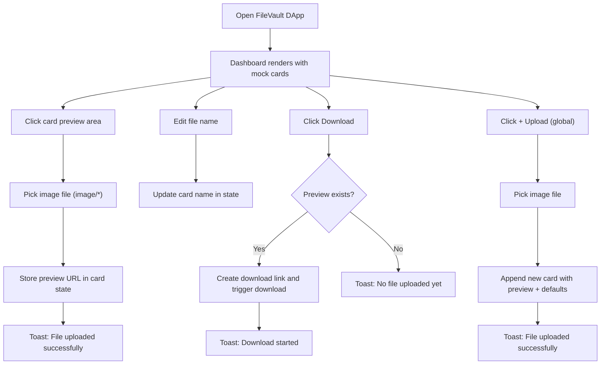

## 1. Product Overview
FileVault DApp is a decentralized-style File Vault dashboard UI that lets users manage “stored” files using mock metadata and local image previews only.
- Purpose: deliver a polished dashboard experience for browsing, previewing, naming, uploading, and downloading file previews without any backend
- Target users: Web3 users who want a familiar “drive” interface with wallet-themed navigation and storage indicators

## 2. Core Features

### 2.1 Feature Module
1. **Dashboard (single page)**: sidebar navigation, top search/connect wallet bar, storage usage, file cards grid
2. **File Cards**: per-card image preview upload, editable file name, file metadata, randomized badge, download action
3. **Global Upload**: + Upload button adds a new card via a global image picker
4. **Toasts**: bottom-right notifications for upload success, download triggered, and empty-download warning

### 2.2 Page Details
| Page Name | Module Name | Feature description |
|-----------|-------------|---------------------|
| Dashboard | Sidebar | Navigation items: Dashboard, Files, Drive Sync, Shared, Trash, Settings; active state highlight |
| Dashboard | Top Bar | Search-like input labeled “Connect Wallet”, storage usage (45.3 GB / 100 GB), avatar |
| Dashboard | Header Actions | “Google Drive sync” button, “+ Upload” button that adds a new card |
| Dashboard | File Grid | Responsive 3-column grid on desktop, stacking to 1 column on small screens |
| Dashboard | File Card | Clickable preview dropzone (image/*), editable file name, badge, download button |
| Dashboard | Toast System | Small stacked toasts bottom-right with auto-dismiss |

## 3. Core Process
- User opens the dashboard and sees 10 mock cards of mixed types (documents, Figma, images, video, PDF).
- User uploads an image preview per card by clicking the preview area; the preview is stored in local component state and shown in the card.
- User can edit the file name inline; the updated name is stored in local state.
- User can click Download to download the uploaded preview image; if none exists, the app shows a toast.
- User can click + Upload to pick an image and append a brand-new card to the grid.

## 4. User Interface Design
### 4.1 Design Style
- Theme: dark navy/slate base using #0f1117 (page) and #1a1d2e (panels)
- Cards: glassmorphism (semi-transparent background + backdrop blur), 16px radius, subtle border and hover glow
- Typography: Google Font “Sora” (preferred) or “DM Sans” for headings and UI text
- Buttons: rounded, high-contrast primary for + Upload; outlined full-width for Download
- Motion: 0.2s ease transitions for hover states, focus rings, card glow, and button interactions
- Icon style: minimal inline SVG icons per file type (document, Figma, image, video, PDF)

### 4.2 Page Design Overview
| Page Name | Module Name | UI Elements |
|-----------|-------------|-------------|
| Dashboard | Background | Gradient-like depth using layered panels; dark navy base with subtle noise/shine |
| Dashboard | Sidebar | Vertical nav, active highlight pill, icons + labels |
| Dashboard | Top Bar | Wallet-connect styled input, storage progress bar, avatar |
| Dashboard | Header | “Dashboard” title, “Drived Wallets” subtitle, “Google Drive sync” CTA, “+ Upload” button |
| Dashboard | File Cards | Preview zone, editable name, metadata row, badge chip, download button |
| Dashboard | Toasts | Bottom-right stack; compact, readable, auto-dismiss |

### 4.3 Responsiveness
- Desktop-first layout with a 3-column card grid that collapses to 2 columns on medium screens and 1 column on small screens
- Sidebar remains accessible; content spacing adapts to touch (larger hit targets, comfortable padding)
