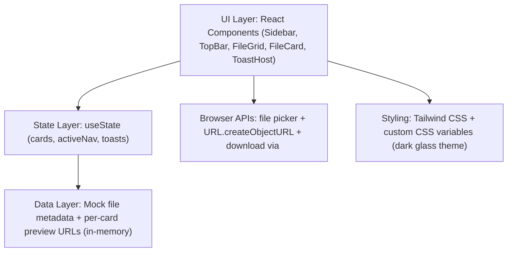
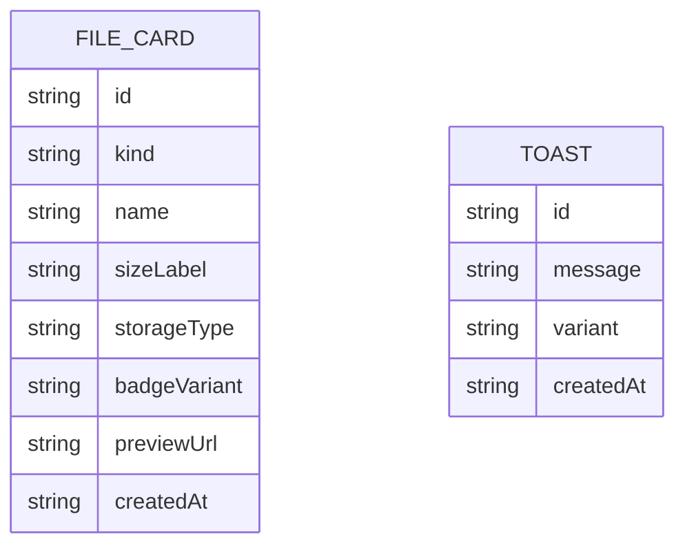

## 1. Architecture Design

## 2. Technology Description
- Frontend: React + TypeScript
- Styling: Tailwind CSS (dark theme, glassmorphism, responsive grid)
- Bundler: Vite
- State management: React useState (no external store)
- Data: mock data only (no backend, no external API calls)
- Notifications: lightweight in-app toast system (no external toast dependency)

## 3. Route Definitions
| Route | Purpose |
|-------|---------|
| / | Single-page dashboard for browsing and managing file cards |

## 4. API Definitions (if backend exists)
No backend. No APIs.

## 5. Server Architecture Diagram (if backend exists)
Not applicable.

## 6. Data Model (in-memory)

### 6.1 Data Model Definition
- File cards are stored as an array in component state.
- Each card stores its own preview reference (object URL) and editable name.
- Toasts are stored as a short-lived array with timestamps/IDs.

### 6.2 Data Definition Language
Not applicable (no database).
